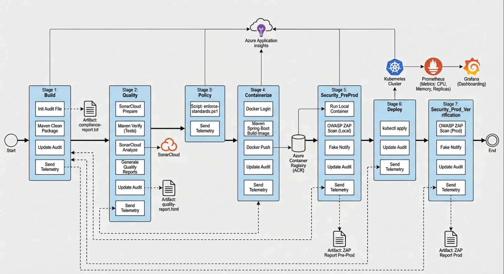

# DevOps Audit Pipeline – Azure DevOps & Kubernetes

## Visão Geral

Este projeto foi desenvolvido como parte de um **desafio técnico para a posição de DevOps Engineer**, com o objetivo de demonstrar **maturidade em CI/CD, DevSecOps, auditoria automatizada, governança em Kubernetes e observabilidade**.

A solução foi projetada seguindo **padrões reais de ambientes corporativos**, priorizando:
- automação,
- rastreabilidade,
- segurança contínua,
- e controle de qualidade antes do deploy em produção.

A aplicação utilizada como base é o **Spring Petclinic**, um projeto **open source amplamente adotado para demonstrações de arquitetura, testes e práticas DevOps**, escolhido por representar um cenário realista de aplicações corporativas Java.

---

## Aplicação Utilizada

- **Nome:** Spring Petclinic  
- **Tecnologia:** Java / Spring Boot  
- **Licença:** Open Source  
- **Objetivo no projeto:**  
  Servir como aplicação base para validação de:
  - pipelines CI/CD
  - qualidade de código
  - segurança dinâmica (DAST)
  - containerização
  - deploy em Kubernetes
  - governança de recursos

---

## Objetivos do Projeto

Este projeto atende integralmente aos objetivos propostos no desafio técnico:

- Auditoria automatizada de pipelines no **Azure DevOps**
- Validação obrigatória de testes antes do deploy
- Integração com **SonarCloud** para qualidade de código
- Integração com **DAST (OWASP ZAP)** em pré e pós-produção
- Implementação de **governança e correção automática em Kubernetes**
- Centralização de logs, métricas e eventos de auditoria
- Geração automática de **relatórios de conformidade, qualidade e segurança**

---

## Arquitetura da Pipeline

A pipeline foi estruturada em **múltiplos estágios independentes**, com **gates explícitos**, garantindo segurança, rastreabilidade e controle de mudanças.

O diagrama abaixo representa a **estrutura completa da pipeline DevSecOps**, evidenciando o fluxo de execução, os gates de controle e as integrações entre qualidade, segurança, governança e deploy em Kubernetes.

  

### 1. Build
- Compilação da aplicação
- Geração de artefatos
- Registro de eventos de execução
- Geração de evidências de auditoria

### 2. Quality Gate (SonarCloud)
- Análise estática de código
- Validação de:
  - cobertura de testes
  - duplicações
  - vulnerabilidades
  - code smells
- **Bloqueio automático da pipeline** em caso de falha no Quality Gate
- Geração de relatório HTML de qualidade

### 3. Policy & Governance (Kubernetes)
- Validação automática de manifests Kubernetes
- Correção automática de configurações fora do padrão:
  - Réplicas mínimas e máximas
  - Limites de CPU e memória
- Bloqueio do pipeline após correção para garantir visibilidade da não conformidade

### 4. Containerização
- Build da imagem Docker utilizando **Spring Boot Buildpacks**
- Publicação da imagem no **Azure Container Registry (ACR)**
- Registro de evidências no relatório de auditoria

### 5. Segurança – Pré-Produção (DAST)
- Deploy da aplicação em container isolado
- Execução de **OWASP ZAP Baseline Scan**
- Bloqueio automático do deploy em caso de vulnerabilidades críticas
- Geração de relatório HTML
- Simulação de notificação ao time de segurança

### 6. Deploy Produção (Kubernetes)
- Deploy da aplicação no cluster Kubernetes
- Aplicação das políticas de governança
- Deploy condicionado à aprovação manual do Tech Lead (Azure DevOps Environments)

### 7. Segurança – Pós-Produção (DAST)
- Nova execução de DAST após deploy
- Garantia de que o ambiente produtivo mantém o mesmo nível de segurança validado em pré-produção

---

## Sistema de Aprovação

A pipeline utiliza **approvals manuais do Azure DevOps**:

- Aprovação obrigatória do **Tech Lead**
- Gate antes de:
  - pré-produção
  - deploy em produção
- Simula fluxo real de ambientes corporativos com controle humano de risco

---

## Segurança (DAST)

A estratégia de DAST foi implementada em **dois momentos críticos**:

- **Pré-Produção:** valida a aplicação antes do deploy final  
- **Pós-Produção:** valida se o ambiente produtivo permanece seguro  

Características:
- Execução automatizada com OWASP ZAP
- Geração de relatórios HTML
- Bloqueio automático do pipeline em falhas críticas
- Simulação de alertas para o time de segurança

---

## Kubernetes & Governança de Recursos

A governança de Kubernetes é garantida por um **script automatizado de auditoria e correção**, responsável por:

### Horizontal Pod Autoscaler (HPA)
- Réplicas mínimas: **3**
- Réplicas máximas: **6**
- Validação obrigatória da existência do HPA

### Limites de Recursos
- CPU máxima por pod: **4 cores**
- Memória máxima por pod: **8Gi**

### Correção Automática
- Configurações fora do padrão são:
  - identificadas
  - corrigidas automaticamente
  - registradas em logs de auditoria

---

## Observabilidade, Métricas e Alertas

- **Prometheus** coleta métricas do cluster Kubernetes
- **Grafana** exibe dashboards com:
  - uso de CPU
  - uso de memória
  - quantidade de réplicas
- Alertas configurados para:
  - uso excessivo de recursos
  - réplicas fora do padrão

Essa abordagem substitui o Azure Monitor, mantendo aderência a **práticas amplamente utilizadas no mercado**.

---

## Auditoria e Evidências

A pipeline gera automaticamente:

- Relatórios de qualidade (SonarCloud)
- Relatórios de segurança (OWASP ZAP)
- Relatórios de auditoria por estágio
- Logs detalhados de execução
- Artefatos versionados no Azure DevOps

Todas as evidências ficam disponíveis para auditoria **sob demanda**.

---
## Limitações Conhecidas

Devido ao uso de **contas gratuitas e ambiente local**, alguns componentes foram simulados ou adaptados:

- Cluster AKS gerenciado
- Integração direta com Azure Monitor
- Envio real de e-mails

Essas limitações **não comprometem o desenho da solução**, que reflete práticas reais de ambientes **enterprise e regulados**.

---

## Conclusão

Esta solução demonstra uma abordagem **end-to-end DevSecOps**, integrando:

- CI/CD
- qualidade de código
- segurança contínua
- governança de Kubernetes
- observabilidade
- auditoria automatizada

O projeto foi desenhado para refletir **cenários reais de produção**, priorizando segurança, rastreabilidade e controle de mudanças.

---

## Autor

**Wander Tavares**  
DevOps Engineer